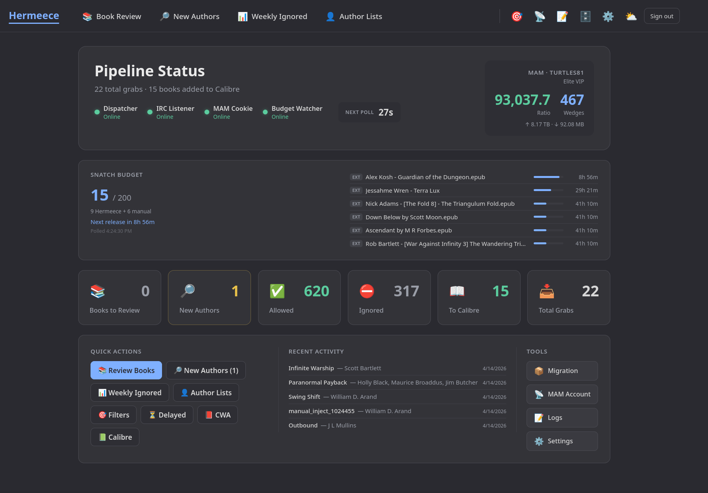

<div align="center">

# Hermeece

**Hermes for the meece.** A self-hosted MAM courier and Calibre ingest pipeline.

[](https://github.com/mnbaker117/hermeece/releases)
[](https://github.com/mnbaker117/hermeece/pkgs/container/hermeece)
[](LICENSE)
[](https://www.python.org/)
[](https://react.dev/)
[](tests/)
[](https://github.com/mnbaker117/hermeece/commits/main)
[](https://github.com/mnbaker117/hermeece)
[](https://github.com/mnbaker117/hermeece/pkgs/container/hermeece)
[](https://github.com/mnbaker117/hermeece/stargazers)

<!-- TODO: Add screenshot — full dashboard with budget widget, MAM card, status pills -->
<!--  -->

</div>

---

## Hey, I made this because I wanted it to exist

I collect ebooks. I run a Calibre library with thousands of books.
[AthenaScout](https://github.com/mnbaker117/AthenaScout) tells me
what I'm missing — but it doesn't go get them. I was tired of
manually browsing MAM, checking my author lists, clicking download,
waiting, checking metadata, fixing covers, importing to Calibre...

So I built a pipeline that does all of that automatically. Hermeece
watches MAM's IRC announce channel in real time, filters against your
personal author lists, downloads through your torrent client, enriches
metadata from 7 sources, queues everything for your manual review with
cover images, and delivers approved books to Calibre/CWA.

It's the other half of AthenaScout. AthenaScout finds the books you're
missing; Hermeece goes and gets them. **Please enjoy.**

---

## What it does

| | Feature | Description |
|---|---|---|
| 📡 | **IRC announce monitoring** | Connects to `irc.myanonamouse.net` via TLS, parses every announce in real time. Reconnects automatically on drops. |
| 👤 | **Author-based filtering** | Three-tier taxonomy: allowed (auto-grab), tentative (unknown author → capture for review), ignored (skip + weekly summary). |
| 💰 | **Policy engine** | VIP, freeleech, wedge, and ratio guards evaluated before every grab. Configurable per-torrent economic decisions. |
| 📊 | **Snatch budget** | Tracks MAM's active-snatches cap with a live dashboard widget. Queues when full, FIFO-rotates to a delayed folder when the queue overflows. |
| 📚 | **Mandatory review queue** | Every downloaded book is enriched and staged for your approval before Calibre delivery. Edit metadata, pick covers, approve or reject. |
| 🔍 | **7-source metadata enrichment** | MAM (primary, zero cost), Goodreads, Amazon, Hardcover, Kobo, IBDB, Google Books. Series-aware confidence scoring. |
| 🖼️ | **Cover images** | MAM poster + enricher cover side by side with click-to-swap selection. |
| 🔎 | **Tentative review** | Announces from unknown authors captured with covers for your decision. Approve = download + train author; reject = weekly review bucket. |
| 📅 | **Daily + weekly digests** | Accepted books, tentative captures, ignored summary, author moves — all via ntfy. |
| 🔄 | **Multi-client support** | qBittorrent (v4 + v5), Transmission, Deluge, rTorrent. |
| 📦 | **Migration wizard** | Relocate existing downloads to organized monthly folders. Server-side background processing — navigate away safely. Empty folder cleanup. |
| 🔐 | **Encrypted credentials** | Fernet-encrypted secrets in a separate auth database. Nothing in plaintext env vars. |
| 🎨 | **Three themes** | Dark, dim, and light. |

---

## Themes

<div align="center">

<!-- TODO: Add screenshot — theme showcase (dark, dim, light side by side or animated GIF) -->
<!--  -->
*Dark · Dim · Light — switchable from the dashboard at any time.*

</div>

---

## Quick start (Docker)

```yaml
services:
  hermeece:
    image: ghcr.io/mnbaker117/hermeece:latest
    container_name: hermeece
    ports:
      - "8788:8788"
    volumes:
      - ./data:/app/data
      - /path/to/downloads:/downloads
      - /path/to/cwa-import:/cwa-ingest
      - /path/to/calibre/books:/calibre
      - ./review-staging:/review-staging
      - ./staging:/staging
    restart: unless-stopped
```

Then open `http://your-server:8788` and follow the first-run wizard.

For Unraid setup, volume mapping details, and the full first-boot
walkthrough, see [`DEPLOY.md`](DEPLOY.md).

---

## The pipeline

<div align="center">

<!-- TODO: Add diagram — pipeline flow from IRC to Calibre (dark themed, matching UI) -->

</div>

```
IRC announce → Filter gate → Policy engine → Rate limiter
    ↓ (allowed)                                  ↓
Tentative capture ← (unknown author)      Fetch .torrent → Client submit
    ↓                                            ↓
Review queue ← (download complete)     Download watcher → Pipeline
    ↓                                            ↓
Metadata enrichment (7 sources)           Stage for review
    ↓                                            ↓
Manual approval ─────────────────────→ CWA / Calibre sink
```

---

## The review queue

<!-- TODO: Add screenshot — review queue with per-source confidence pills, cover selection, metadata fields -->
<!--  -->

Every downloaded book passes through the review queue before reaching
Calibre. Each card shows:

- **Cover images** — MAM poster and enricher cover with click-to-swap
- **Per-source confidence pills** — see exactly which scrapers matched
  and at what confidence (e.g. `mam 100%` `goodreads 92%` `amazon 85%`)
- **Rich metadata** — title, author, series + index, publisher, ISBN,
  page count, publication date, description
- **Inline editing** — fix any field before approving
- **Approve / Reject** — approve delivers to your sink; reject deletes
  the staged copy (the seeding original is untouched)

---

## The dashboard

<!-- TODO: Add screenshot — full dashboard with pipeline status, budget widget, MAM card, stat cards, quick actions -->
<!--  -->

The dashboard is your control center:

- **Pipeline status** — dispatcher, IRC, MAM cookie, budget watcher health with live countdown to next poll
- **MAM account** — ratio, wedges, upload/download, class
- **Snatch budget widget** — used/cap with per-torrent seedtime progress bars and next-release countdown
- **Stat cards** — books to review, new authors, allowed/ignored counts, Calibre additions, total grabs
- **Quick actions** — one-click navigation to review, tentative, authors, filters + CWA/Calibre web UI links
- **Recent activity** — last 5 grabs with author and date

---

## Sibling project: AthenaScout

<div align="center">

[AthenaScout](https://github.com/mnbaker117/AthenaScout) scans your
Calibre library against Goodreads, Hardcover, and Kobo to find every
book you're missing. Hermeece watches MAM for those books and
downloads them automatically.

**AthenaScout finds them. Hermeece gets them.**

</div>

---

## Architecture

- **Backend:** FastAPI + SQLite (WAL mode) + aiosqlite
- **Frontend:** Vite + React 18 + TypeScript
- **Background jobs:** supervised asyncio tasks + APScheduler
- **Auth:** bcrypt + itsdangerous signed cookies + Fernet-encrypted secrets
- **Metadata scoring:** Jaccard + containment + substring matching with series-aware boosting
- **Docker:** two-stage build (node:22-alpine → python:3.12-slim)

---

## Download clients

| Client | Status | Notes |
|---|---|---|
| **qBittorrent** | Fully tested | v4 + v5 API compatibility (auto-detects) |
| **Transmission** | Implemented | RPC with X-Transmission-Session-Id auto-refresh |
| **Deluge** | Implemented | JSON-RPC with Label plugin auto-detection |
| **rTorrent** | Implemented | XML-RPC via reverse proxy, d.custom1 for labels |

---

## Sinks (delivery targets)

| Sink | Description |
|---|---|
| **CWA** | Atomic write to Calibre-Web-Automated's ingest folder |
| **Calibre** | Direct `calibredb add` to your library |
| **Folder** | Copy to any directory |
| **Audiobookshelf** | Library folder delivery |

---

## Requirements

- **Docker** (recommended) or Python 3.12+ for development
- A **MyAnonamouse** account with:
  - IRC nick + SASL credentials
  - Session cookie (`mam_id`)
- A **torrent client** (qBittorrent, Transmission, Deluge, or rTorrent)
- *Optional:* **Hardcover API key** for richer metadata
- *Optional:* **ntfy** server/topic for notifications

---

## Configuration

All configuration is managed through the web UI after first boot.
Settings persist in `settings.json`; credentials are Fernet-encrypted
in `hermeece_auth.db`. No sensitive values in environment variables.

See [`DEPLOY.md`](DEPLOY.md) for the complete first-boot walkthrough.

---

## Contributing

PRs and issues are welcome. The codebase is heavily documented:

- [`app/orchestrator/dispatch.py`](app/orchestrator/dispatch.py) — the dispatcher (filter → policy → rate limit → grab)
- [`app/orchestrator/pipeline.py`](app/orchestrator/pipeline.py) — post-download pipeline (enrich → review → sink)
- [`app/metadata/sources/`](app/metadata/sources/) — 7 scraper implementations
- [`app/metadata/scoring.py`](app/metadata/scoring.py) — confidence scoring system
- [`app/clients/`](app/clients/) — torrent client protocol + 4 implementations

### Adding a new metadata source

Implement the `MetaSource` base class in [`app/metadata/sources/base.py`](app/metadata/sources/base.py).
The existing sources cover four scraping patterns: HTML (Goodreads, Amazon, Kobo),
GraphQL (Hardcover), REST API (IBDB, Google Books), and internal API (MAM).

### Adding a new torrent client

Implement the `TorrentClient` protocol in [`app/clients/base.py`](app/clients/base.py).
The four existing clients are reference implementations.

---

## License

[MIT](LICENSE)

---

<div align="center">

*Built by a self-hoster who got tired of manually downloading books.*

*AthenaScout finds them. Hermeece gets them.*

</div>
